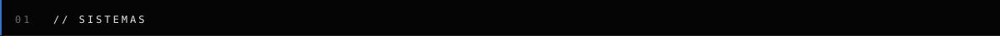
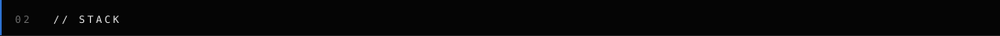
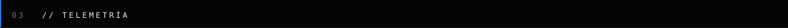
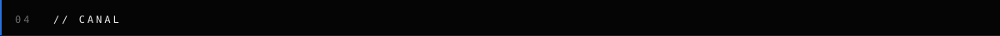
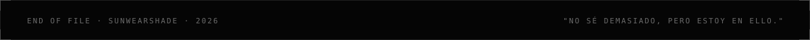

  

 

  <samp>
  Estudiante de Ingeniería en Desarrollo de Software. 
  Construyo sistemas operativos para gente real: terminales de captura, dashboards, backends y bots. 
  Menos ruido, más cosas que funcionan.
  </samp>

 

<table width="100%">
  <tr>
    <td width="18%"><samp><b>KOIDE</b></samp></td>
    <td width="52%"><samp>Suite industrial: terminales de captura e inspección, dashboard, calidad y forklift. Node · Express · MySQL · Socket.IO.</samp></td>
    <td width="30%" align="right">
      <a href="https://github.com/Sunwearshade/koide-general"><samp>general</samp></a> ·
      <a href="https://github.com/Sunwearshade/Koide-Dashboard"><samp>dashboard</samp></a> ·
      <a href="https://github.com/Sunwearshade/koide-capture-terminal-"><samp>capture</samp></a>
    </td>
  </tr>
  <tr>
    <td><samp><b>NAUTITEQ</b></samp></td>
    <td><samp>Gestión de usuarios y embarcaciones. PHP · JS.</samp></td>
    <td align="right"><a href="https://github.com/Sunwearshade/Nautiteq"><samp>repo →</samp></a></td>
  </tr>
  <tr>
    <td><samp><b>LYRICSMY</b></samp></td>
    <td><samp>Visualizador de letras. Frontend Angular + Ionic, backend Express + MySQL.</samp></td>
    <td align="right">
      <a href="https://github.com/Sunwearshade/Frontend_LyricsMy"><samp>frontend</samp></a> ·
      <a href="https://github.com/Sunwearshade/Backend_lyricsmy"><samp>backend</samp></a>
    </td>
  </tr>
  <tr>
    <td><samp><b>FACE RECOGNITION</b></samp></td>
    <td><samp>Reconocimiento facial en Python y detector web con face-api.js.</samp></td>
    <td align="right">
      <a href="https://github.com/Sunwearshade/Face_recognition_system"><samp>python</samp></a> ·
      <a href="https://github.com/Sunwearshade/webFaceDetector"><samp>web</samp></a>
    </td>
  </tr>
  <tr>
    <td><samp><b>CRYPTO ANALYZER</b></samp></td>
    <td><samp>Bot de Telegram que analiza mercados y genera gráficas. Node · QuickChart.</samp></td>
    <td align="right"><a href="https://github.com/Sunwearshade/Crypto_analyzer"><samp>repo →</samp></a></td>
  </tr>
</table>

 

 

  
  
  
  
   
  
  
  
  
  
   
  
  
  
  

 

 

  
  

  

 

 

  
  
  

 

  

